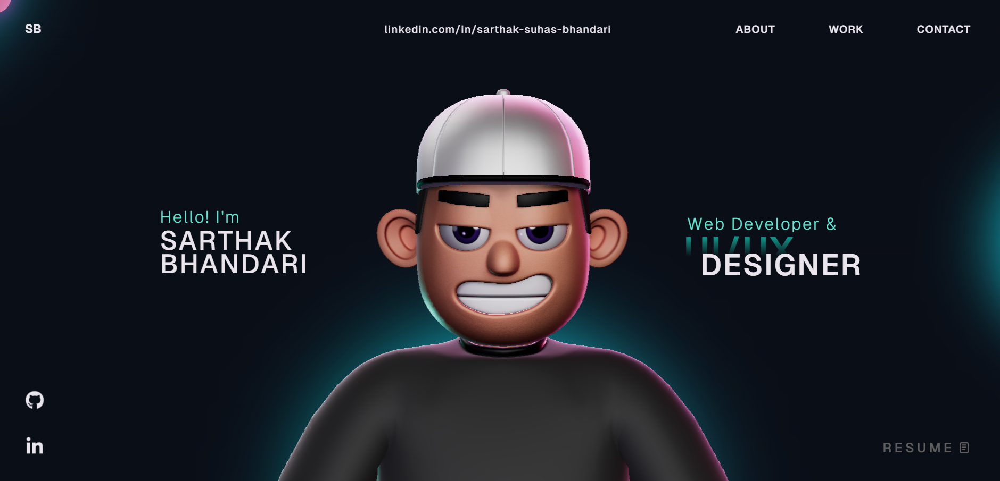

# Sarthak Bhandari — 3D Portfolio

Personal portfolio website built with React, TypeScript, Three.js, and GSAP. Features a 3D animated character scene, scroll-driven animations, interactive skill sections, and a clean project showcase.

Live site: [https://github.com/sarthak0105/Sarthak-Bhandari-Portfolio](https://github.com/sarthak0105/Sarthak-Bhandari-Portfolio)



## About

I'm a Computer Science & Business Systems student who builds things that matter. From AI-powered platforms like MindSync and VOX-AI to deployment tools like DeployZen, I work across the full stack — UI/UX, frontend, backend, and ML — with a sharp focus on clean design and measurable impact.

- LinkedIn: [linkedin.com/in/sarthak-suhas-bhandari](https://www.linkedin.com/in/sarthak-suhas-bhandari)
- GitHub: [github.com/sarthak0105](https://github.com/sarthak0105)
- Email: sarthakbhandarisb0105@gmail.com

## Projects Featured

- **MindSync** — Full-stack RAG platform (Next.js, FastAPI, NVIDIA NIM, pgvector, Gemini) — [docu-rag-pink.vercel.app](https://docu-rag-pink.vercel.app)
- **VOX-AI** — AI-powered debate analysis platform (Next.js, Gemini API) — [vox-ai.vercel.app](https://vox-ai.vercel.app)
- **DeployZen** — Lightweight ML deployment platform (ONNX Runtime) — [deploy-zen-five.vercel.app](https://deploy-zen-five.vercel.app)

## Tech Stack

### Core
- React 18 + TypeScript + Vite

### 3D & Animation
- Three.js, `@react-three/fiber`, `@react-three/drei`, `@react-three/rapier`
- GSAP + ScrollTrigger + ScrollSmoother + SplitText

### Supporting
- `react-icons`, `react-fast-marquee`, `@vercel/analytics`

## Skills

- **Languages**: C, Python, JavaScript, SQL, HTML5, CSS3
- **Frontend**: React.js, Next.js, Bootstrap
- **Backend**: Node.js, Flask, REST APIs, Docker, ONNX Runtime
- **AI/ML**: Gemini API, LLaMA AI, ResNet, Pandas, NumPy
- **Databases**: MongoDB, MySQL
- **UI/UX**: Figma, Adobe Illustrator

## Getting Started

```bash
# Clone the repo
git clone https://github.com/sarthak0105/Sarthak-Bhandari-Portfolio.git
cd Sarthak-Bhandari-Portfolio

# Install dependencies
npm install

# Start dev server
npm run dev
```

Open `http://localhost:5173` in your browser.

## Available Scripts

- `npm run dev` — Start development server
- `npm run build` — Build for production
- `npm run preview` — Preview production build
- `npm run lint` — Run ESLint

## Project Structure

```text
.
├── public/                    # Static assets (images, models, resume)
├── src/
│   ├── components/
│   │   ├── Character/         # 3D scene + character logic
│   │   ├── styles/            # Component CSS files
│   │   ├── About.tsx
│   │   ├── Skills.tsx
│   │   ├── Contact.tsx
│   │   ├── Landing.tsx
│   │   ├── MainContainer.tsx
│   │   ├── Navbar.tsx
│   │   ├── TechStack.tsx
│   │   ├── WhatIDo.tsx
│   │   └── Work.tsx
│   ├── context/               # Loading state provider
│   ├── data/                  # Static data definitions
│   ├── App.tsx
│   └── main.tsx
├── package.json
└── vite.config.ts
```

## Deployment

```bash
npm run build
npm run preview
```

Deploy the `dist/` folder to Vercel, Netlify, or Cloudflare Pages.

## License

This project is open source and available under the [MIT License](LICENSE).
